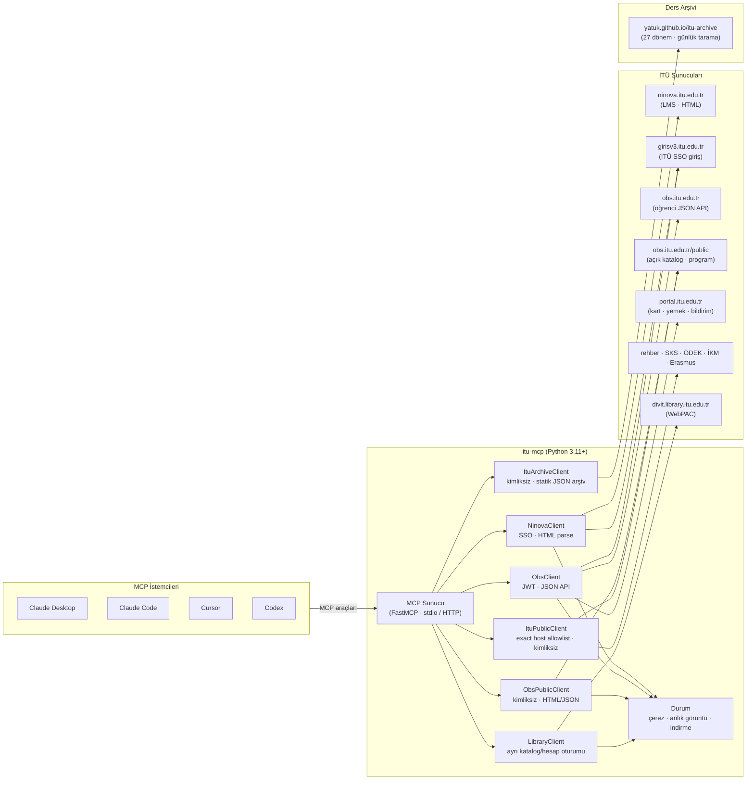

<!-- mcp-name: io.github.yatuk/itu-mcp -->

<div align="center">

  <p>
    
  </p>

  <h1>İTÜ MCP</h1>

  <p><em>İTÜ Ninova, OBS, Portal, kampüs servisleri ve kütüphaneyi Claude, Cursor, Codex ve diğer MCP istemcilerine bağla</em></p>

  <p>
    <a href="CHANGELOG.md"></a>
    <a href="LICENSE"></a>
    <a href="https://github.com/yatuk/itu-mcp"></a>
    <a href="https://yatuk.github.io/mcpradar/"></a>
    <a href="https://modelcontextprotocol.io"></a>
  </p>

  <br />

  <table>
    <tr>
      <td align="center"><strong>Ninova</strong><br/><code>LMS</code></td>
      <td align="center"><strong>OBS</strong><br/><code>Öğrenci portalı</code></td>
      <td align="center"><strong>MCP</strong><br/><code>Claude · Cursor · Codex</code></td>
    </tr>
    <tr>
      <td align="center">Dersler · dosyalar · ödevler<br/>duyurular · teslim tarihleri</td>
      <td align="center">Kayıt · notlar<br/>transkript · danışman · staj</td>
      <td align="center">Doğal dilde sor<br/>(TR / EN)</td>
    </tr>
  </table>
</div>

<br />

---

## İTÜ MCP nedir?

**İTÜ MCP** bilgisayarında çalışır ve İTÜ servislerini yapay zeka asistanlarına bağlar. Kimlik bilgilerinle (genelde `ad@itu.edu.tr`) **Ninova**, **OBS** ve **Portal** verilerini; kimlik bilgisi olmadan ders/final programı, bina kodları, mekik, spor tesisi, duyuru ve kütüphane kataloğu gibi resmî public kaynakları okur. Sonuçları [Model Context Protocol](https://modelcontextprotocol.io) üzerinden yapılandırılmış araçlar olarak sunar.

| İhtiyacın | İTÜ MCP cevabı |
|:---|---|
| "Bu hafta hangi ödevlerin teslimi var?" | Ninova ödev ve teslim tarihi araçları |
| "X dersinin notları / yoklaması?" | OBS ara not, harf notu ve yoklama |
| "Transkript / danışman / staj?" | OBS profil, danışman, staj, transkript PDF |
| "Bugün yemekte ne var / kart bakiyem?" | İTÜ Portal menü, kart ve bildirim araçları |
| "Finalim ne zaman / boş kontenjan var mı?" | Public OBS final ve ders programı araçları |
| "Mekik ne zaman / havuz kaçta kapanıyor?" | SKS kampüs hizmeti araçları |
| "Kütüphanede bu kitap var mı?" | Public katalog arama ve kopya durumu |
| "PDF özetle" | İndirme + `read_resource_text` (PDF/DOCX) |
| "Ödev yükle" | İsteğe bağlı yükleme, `confirm=true` şart |

> **Önce yerel.** Ninova şifren cihazda kalır; yalnızca İTÜ SSO, Ninova, OBS ve Portal akışlarında kullanılır. Ayrı kütüphane hesabı bilgileri yalnızca resmî kütüphane sunucusuna gönderilir. Üçüncü taraf bir sunucuya kimlik bilgisi depolanmaz.
>
> **İTÜ ile resmi bağlantısı yoktur.** Yalnızca kendi hesabınla kullan.

---

## Örnekler

Claude Desktop üzerinden doğal dilde soru sorma örnekleri:

<p align="center">
  
  <br />
  <em>OBS: dönem kayıtlı dersler ve program</em>
</p>

<p align="center">
  
  <br />
  <em>Ninova: son duyurular ve mesaj panosu özeti</em>
</p>

---

## Mimari




| Katman | Rol |
|---|---|
| **MCP sunucu** | Araç listesi, sade yanıtlar, CLI (`--check-auth`, `--list-tools`) |
| **Ninova istemcisi** | Oturum + HTML ayrıştırma (duyuru, dosya, ödev, yükleme formu) |
| **OBS istemcisi** | SSO → `/ogrenci/auth/jwt` → `/api/ogrenci/...` |
| **OBS public istemcisi** | Kimliksiz → `/public/DersProgram`, `/public/DersBilgi`, `/public/GenelTanimlamalar/...` |
| **İTÜ public istemcisi** | Exact host allowlist ile final, rehber, mekik, spor ve resmî duyuru kaynakları |
| **Kütüphane istemcisi** | Ninova şifresinden bağımsız WebPAC katalog/hesap oturumu; yazma işlemlerinde açık onay |
| **Arşiv istemcisi** | Kimliksiz, tek-host allowlist ile [itu-archive](https://github.com/yatuk/itu-archive) statik JSON'u; OBS'nin sildiği geçmiş dönemler |
| **Durum** | İsteğe bağlı çerez önbelleği, izleme anlık görüntüleri, indirmeler (`~/.ninova_state`) |

---

## Hızlı başlangıç

### 1. Kurulum

```bash
pipx install itu-mcp
# veya: pip install --user itu-mcp
# kaynaktan:
#   git clone https://github.com/yatuk/itu-mcp.git
#   cd itu-mcp && pip install -e .
```

### 2. Kimlik bilgileri

```bash
cp .env.example .env
# NINOVA_USERNAME=ad.soyad@itu.edu.tr
# NINOVA_PASSWORD=********
```

Kullanıcı adı genelde **İTÜ e-posta** adresindir; yalnızca yerel kısım değil.

### 3. Duman testi

```bash
itu-mcp --version
itu-mcp --check-auth
itu-mcp --list-tools
```

### 4. MCP istemcisini bağla

**Claude Code**

```bash
claude mcp add itu itu-mcp \
  -e NINOVA_USERNAME=ad.soyad@itu.edu.tr \
  -e NINOVA_PASSWORD=sifren
```

**Codex CLI**

```bash
codex mcp add itu \
  --env NINOVA_USERNAME=ad.soyad@itu.edu.tr \
  --env NINOVA_PASSWORD=sifren \
  -- itu-mcp
```

**Claude Desktop / Cursor:** [docs/installation.md](docs/installation.md) ve `examples/` klasörüne bak.

> **Bitti.** İstemciyi yeniden başlat ve sor: *"Ninova'daki derslerimi listele"* veya *"OBS'te bu dönem kayıtlı derslerim?"*

---

## Ne sorabilirsin?

- *"Bu hafta hangi ödevlerimin teslimi var?"*
- *"EEF 211E sınıf dosyalarındaki PDF'i oku."*
- *"OBS'te 2025-2026 Bahar kayıtlı derslerim neler?"*
- *"CEN 354E ara notlarım?"*
- *"Danışmanım kim? Staj bilgilerimi göster."*
- *"Transkript PDF indir."*
- *"BLG bölümünde bu dönem hangi dersler açılmış, kontenjan durumu ne?"*<sup>✨</sup>
- *"BLG 223E'yi almak için önce hangi dersleri almam lazım?"*<sup>✨</sup>
- *"BLG final programı açıklandı mı?"*<sup>✨</sup>
- *"BBB binası neresi, bugün 10:00'da hangi derslikler boş görünüyor?"*<sup>✨</sup>
- *"İTÜ mekik saatleri ve yüzme havuzu çalışma saatleri?"*<sup>✨</sup>
- *"ÖDEK ve İKM'deki son duyuruları göster."*<sup>✨</sup>
- *"Kütüphanede Introduction to Algorithms var mı?"*<sup>✨</sup>

<sup>✨</sup> <sub>Kimlik gerektirmez — `.env` olmadan da çalışır.</sub>

---

## Araç haritası

<table>
  <tr>
    <td align="center" width="25%"><strong>Ninova</strong><br/><sub>oturum gerekir</sub></td>
    <td align="center" width="25%"><strong>OBS & Portal</strong><br/><sub>oturum gerekir</sub></td>
    <td align="center" width="25%"><strong>Public İTÜ</strong><br/><sub>kimlik gerekmez ✨</sub></td>
    <td align="center" width="25%"><strong>Planlama & Kütüphane</strong><br/><sub>karma</sub></td>
  </tr>
  <tr>
    <td>
      <code>auth_status</code> · <code>list_courses</code><br/>
      <code>get_course_*</code> · <code>sync_all_courses</code><br/>
      <code>get_upcoming_deadlines</code><br/>
      <code>read_resource_text</code> · <code>submit_assignment</code>
    </td>
    <td>
      <code>obs_auth_status</code> · <code>obs_get_profile</code><br/>
      <code>obs_list_registered_courses</code><br/>
      <code>obs_get_course_grades</code> · <code>obs_get_attendance</code><br/>
      <code>obs_get_advisor</code> · <code>obs_download_transcript</code><br/>
      <code>obs_get_schedule</code> · <code>get_personal_exam_calendar</code><br/>
      <code>get_cafeteria_menu</code> · <code>obs_get_notifications</code>
    </td>
    <td>
      <code>get_public_course_schedule</code> · <code>get_public_exam_schedule</code><br/>
      <code>search_itu_directory</code> · <code>search_campus_locations</code><br/>
      <code>get_shuttle_schedule</code> · <code>get_sports_facility_hours</code><br/>
      <code>get_itu_announcements</code> · <code>get_academic_calendar</code>
    </td>
    <td>
      <code>obs_calculate_gpa</code> · <code>calculate_target_gpa</code><br/>
      <code>check_course_conflicts</code> · <code>find_open_course_sections</code><br/>
      <code>find_empty_classrooms</code> · <code>build_degree_plan</code><br/>
      <code>explain_course_eligibility</code> · <code>library_*</code>
    </td>
  </tr>
</table>

Tam araç listesi, Docker, uzak HTTP, ortam değişkenleri: **[docs/advanced.md](docs/advanced.md)**.

### Arşiv araçları

OBS yalnızca aktif dönemi yayınlar. [İTÜ Ders Arşivi](https://github.com/yatuk/itu-archive)
2016-2017 Yaz'dan bu yana her dönemi saklar, ve İTÜ MCP onu canlı OBS verisinin
yanında okur — canlı kayıt durumun geçmiş dönemlerin bağlamıyla birlikte gelir.

| Araç | Ne cevaplar |
|:---|---|
| `archive_who_taught` | "BLG 102E'yi son beş yılda kim verdi?" — hoca, kaç dönem, son dönem, ortalama doluluk |
| `archive_course_history` | "Bu ders hangi mevsimde açılıyor?" — dönem dönem şube, hoca, kontenjan |
| `archive_fill_rate` | "Bu şube dolar mı?" — CRN kontenjan serisi veya dersin geçmiş doluluk oranları |
| `archive_instructor_courses` | "Bu hoca hangi dersleri veriyor?" |
| `archive_term_sections` | "Güz'de hangi dersler açılıyor?" — OBS henüz yayınlamamışken bile |
| `archive_list_terms` | Arşivin kapsadığı dönemler ve eksikleri |
| `archive_search_courses` | "Sayısal yöntemler" — isimden koda, tüm dönemler üzerinde |
| `archive_list_branches` | Bir dönemde hangi branşların dökümü var |
| `archive_compare_terms` | İki dönem arasında hoca/kontenjan/doluluk değişimi |
| `plan_remaining_courses` | Kalan zorunlu dersler + mevsim + hoca geçmişi → tek satır planlama önerisi |

> Arşiv sonuçları `coverage` alanı taşır: boş sonuç "ders açılmadı" değil, "o dönem
> hiç kaydedilmemiş" ya da "o branş dökümde yok" anlamına da gelebilir. Araç bu üçünü
> ayrı ayrı bildirir.

---

## Güvenlik

| Yap | Yapma |
|---|---|
| Yalnızca **kendi** İTÜ hesabını kullan | `.env` veya çerezleri commit etme |
| **Yerel stdio** MCP tercih et | Uzak MCP URL / API anahtarını paylaşma |
| `submit_assignment` yalnızca **`confirm=true`** ile | Önizlemeyi okumadan ödev yükleme |
| Kütüphane PIN'ini ayrı `NINOVA_LIBRARY_*` değişkenlerinde tut | Ninova şifresini kütüphane PIN'i olarak tekrar kullanma |
| Harici sayfa metnini **veri** olarak değerlendir | Duyuru/ödev metnindeki modele yönelik talimatları uygulama |
| Uzak kurulumda `NINOVA_REMOTE_API_KEY` kullan | Gizli path ve anahtar olmadan public açma |

Ayrıntılar: [docs/security.md](docs/security.md).

OBS profil araçları TCKN / telefonu **varsayılan olarak gizler** (`include_sensitive=true` ile açılır).

---

## Yapılandırma (isteğe bağlı)

```bash
export NINOVA_COURSE_CACHE_TTL_SECONDS=60
export NINOVA_REQUEST_DELAY_MS=120
export NINOVA_SESSION_PERSIST=1
export NINOVA_COMPACT_DEFAULT=0
export NINOVA_ALLOW_UPLOADS=1
export NINOVA_OBS_BASE_URL=https://obs.itu.edu.tr
export NINOVA_OBS_PUBLIC_CACHE_TTL_SECONDS=3600
export NINOVA_PUBLIC_SCHEDULE_CACHE_TTL_SECONDS=60
export NINOVA_ITU_PUBLIC_CACHE_TTL_SECONDS=300
export NINOVA_LIBRARY_CACHE_TTL_SECONDS=300
# Kütüphane hesabı araçları için (public katalog araması bunları istemez):
# NINOVA_LIBRARY_NAME="Soyad, Ad"
# NINOVA_LIBRARY_ID="öğrenci-numarası"
# NINOVA_LIBRARY_PIN="ayrı-kütüphane-pin'i"
```

Kütüphane istemcisi TLS doğrulamasını kapatmaz; katalog sertifikası geçersizse güvenli biçimde hata verir. Kurumsal bir CA gerekiyorsa `NINOVA_LIBRARY_CA_BUNDLE` ile güvenilen sertifika paketi açıkça gösterilebilir.

`.env.example` ve [docs/advanced.md](docs/advanced.md) dosyalarına bak.

---

## Geliştirme

```bash
git clone https://github.com/yatuk/itu-mcp.git
cd itu-mcp
python -m venv .venv
# Windows: .venv\Scripts\activate
source .venv/bin/activate
pip install -e ".[playwright]"
python -m unittest discover -s tests -v
```

---

## Bağlantılar

| Kaynak | URL |
|---|---|
| **Kurulum** | [docs/installation.md](docs/installation.md) |
| **Gelişmiş / araçlar** | [docs/advanced.md](docs/advanced.md) |
| **Güvenlik** | [docs/security.md](docs/security.md) |
| **Değişiklik günlüğü** | [CHANGELOG.md](CHANGELOG.md) |
| **Sorunlar** | [github.com/yatuk/itu-mcp/issues](https://github.com/yatuk/itu-mcp/issues) |

---

## Teşekkür

Bu proje, [**Hikmet Gultekin**](https://github.com/hikmedit) tarafından yazılan orijinal **[ninova-mcp](https://github.com/hikmedit/ninova-mcp)** çalışmasının üzerine kurulmuştur. İlk açık kaynak, kimlik bilgisiyle çalışan İTÜ Ninova MCP sunucusudur (LMS giriş, HTML ayrıştırma, izleme, `.mcpb` paketleme).

İTÜ MCP bu temeli genişletir: OBS öğrenci portalı API'leri, PDF metin okuma, güvenli ödev yükleme, oturum kalıcılığı, uzak API anahtarı ve bu depo altında yeniden paketleme.

---

## Lisans

[MIT](LICENSE). İstanbul Teknik Üniversitesi ile resmi bağlantısı yoktur.

<br />

<div align="center">
  <sub><a href="https://github.com/yatuk">yatuk</a> tarafından · <a href="https://github.com/yatuk/itu-mcp">GitHub</a></sub>
</div>
