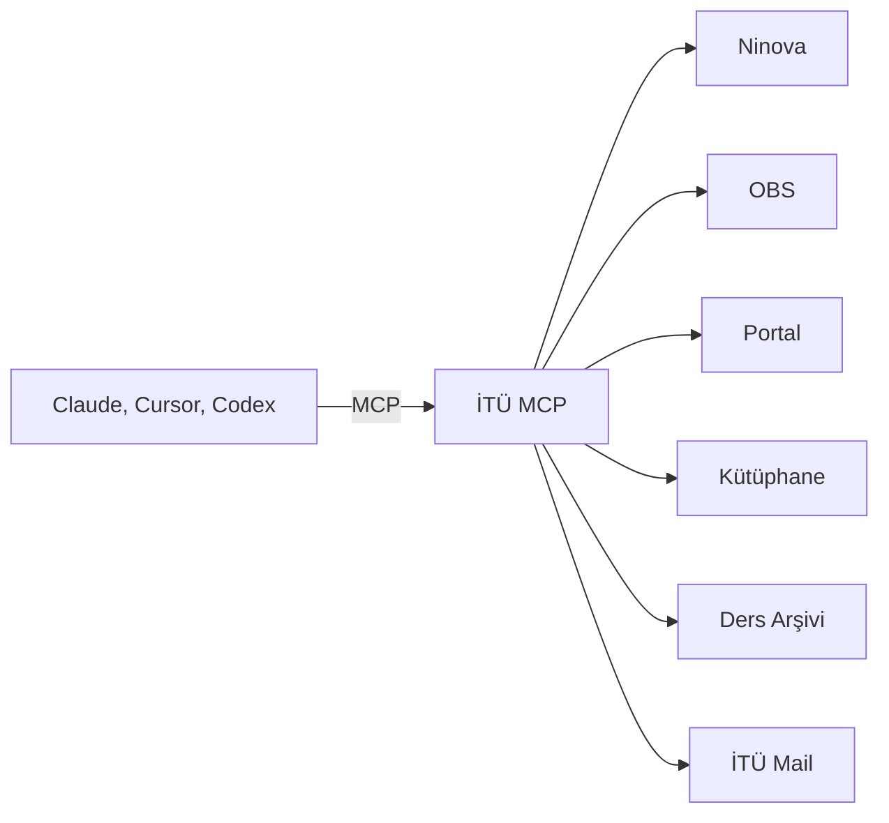

<!-- mcp-name: io.github.yatuk/itu-mcp -->

<div align="center">

  <p>
    
  </p>

  <h1>İTÜ MCP</h1>

  <p><em>İTÜ Ninova, OBS, Portal, kampüs servisleri ve kütüphaneyi Claude, Cursor, Codex ve diğer MCP istemcilerine bağla</em></p>

  <p>
    <a href="CHANGELOG.md"></a>
    <a href="LICENSE"></a>
    <a href="https://github.com/yatuk/itu-mcp"></a>
    <a href="https://yatuk.github.io/mcpradar/"></a>
    <a href="https://modelcontextprotocol.io"></a>
  </p>

</div>

---

## İTÜ MCP nedir?

Ninova'da ödev, OBS'de not, Portal'da yemek listesi diye üç ayrı sekmede gezinmek can sıkıcı. İTÜ MCP bilgisayarında çalışan küçük bir sunucu, bu sekmelerin hepsini tek bir yerden, doğal dilde sorulabilir hale getiriyor.

Kimlik bilgilerinle (genelde `ad@itu.edu.tr`) **Ninova**, **OBS** ve **Portal** verilerini okuyor. Kimlik bilgisi olmadan da ders/final programı, bina kodları, mekik, spor tesisi, duyuru ve kütüphane kataloğu gibi herkese açık kaynaklara erişiyor. Sonuçları [Model Context Protocol](https://modelcontextprotocol.io) üzerinden yapılandırılmış araçlar olarak sunuyor: Claude'a soruyorsun, o da gerçek veriyi çekip cevap veriyor.

| İhtiyacın | İTÜ MCP cevabı |
|:---|---|
| "Bu hafta hangi ödevlerin teslimi var?" | Ninova ödev ve teslim tarihi araçları |
| "X dersinin notları / yoklaması?" | OBS ara not, harf notu ve yoklama |
| "Transkript / danışman / staj?" | OBS profil, danışman, staj, transkript PDF |
| "Bugün yemekte ne var / kart bakiyem?" | İTÜ Portal menü, kart ve bildirim araçları |
| "Finalim ne zaman / boş kontenjan var mı?" | Public OBS final ve ders programı araçları |
| "Mekik ne zaman / havuz kaçta kapanıyor?" | SKS kampüs hizmeti araçları |
| "Kütüphanede bu kitap var mı?" | Public katalog arama ve kopya durumu |
| "Son okunmamış mailimi göster" | Salt okunur İTÜ Mail araçları |
| "PDF özetle" | İndirme ve `read_resource_text` (PDF/DOCX) |
| "Ödev yükle" | İsteğe bağlı yükleme, `confirm=true` şart |

> **Önce yerel.** Ninova şifren cihazda kalır, yalnızca İTÜ SSO, Ninova, OBS ve Portal akışlarında kullanılır. Ayrı kütüphane hesabı bilgileri yalnızca resmî kütüphane sunucusuna gönderilir. Üçüncü taraf bir sunucuya kimlik bilgisi depolanmaz.
>
> **İTÜ ile resmi bağlantısı yoktur.** Yalnızca kendi hesabınla kullan.

Dürüst olmak gerekirse OBS'nin bazı uç noktaları hesaba göre tutarsız davranabiliyor, bir hesapta not alanı boş dönerken başka bir hesapta doluyor gibi. Böyle durumları elimizden geldiğince yakalayıp yedek kaynağa düşüyoruz ve sonucu açıkça işaretliyoruz, ama tam garanti veremeyiz. Şüpheye düştüğünde her zaman OBS'nin kendi sayfasına bak.

---

## Nasıl çalışır


```mermaid
graph LR
    istemci["Claude, Cursor, Codex"] -->|"MCP"| sunucu["İTÜ MCP"]
    sunucu --> ninova["Ninova"]
    sunucu --> obs["OBS"]
    sunucu --> portal["Portal"]
    sunucu --> kutuphane["Kütüphane"]
    sunucu --> arsiv["Ders Arşivi"]
    sunucu --> mail["İTÜ Mail"]
```

Sunucu her servise ayrı bir istemci sınıfıyla konuşur, kendi oturumunu ve önbelleğini yönetir. Ninova ve OBS aynı İTÜ SSO girişini paylaşır, kütüphane hesabı bilgisi ise tamamen ayrıdır ve Ninova şifresiyle karışmaz. Kimlik gerektirmeyen araçlar (public ders programı, kampüs servisleri, arşiv) hiçbir zaman şifreni kullanmaz.

Ayrıntılı iç mimari ve istemci sınıfları için: [docs/advanced.md](docs/advanced.md).

---

## Örnekler

<p align="center">
  
  <br />
  <em>CLI: <code>--version</code>, <code>--list-tools</code>, <code>--list-prompts</code> (gerçek çıktı)</em>
</p>

Claude Desktop üzerinden doğal dilde soru sorma örnekleri:

<p align="center">
  
  <br />
  <em>OBS: dönem kayıtlı dersler ve program</em>
</p>

<p align="center">
  
  <br />
  <em>Ninova: son duyurular ve mesaj panosu özeti</em>
</p>

---

## Hızlı başlangıç

### 1. Kurulum

```bash
pipx install itu-mcp
# veya: pip install --user itu-mcp
# kaynaktan:
#   git clone https://github.com/yatuk/itu-mcp.git
#   cd itu-mcp && pip install -e .
```

### 2. Kimlik bilgileri

```bash
cp .env.example .env
# NINOVA_USERNAME=ad.soyad@itu.edu.tr
# NINOVA_PASSWORD=********
```

Kullanıcı adı genelde **İTÜ e-posta** adresidir, yalnızca yerel kısım değil.

### 3. Duman testi

```bash
itu-mcp --version
itu-mcp --check-auth
itu-mcp --list-tools
itu-mcp --list-prompts
```

### 4. MCP istemcisini bağla

**Claude Code**

```bash
claude mcp add itu itu-mcp \
  -e NINOVA_USERNAME=ad.soyad@itu.edu.tr \
  -e NINOVA_PASSWORD=sifren
```

**Codex CLI**

```bash
codex mcp add itu \
  --env NINOVA_USERNAME=ad.soyad@itu.edu.tr \
  --env NINOVA_PASSWORD=sifren \
  -- itu-mcp
```

**Claude Desktop / Cursor:** [docs/installation.md](docs/installation.md) ve `examples/` klasörüne bak.

> **Bu kadar.** İstemciyi yeniden başlat ve sor: *"Ninova'daki derslerimi listele"* veya *"OBS'te bu dönem kayıtlı derslerim?"*

---

## Ne sorabilirsin?

- *"Bu hafta hangi ödevlerimin teslimi var?"*
- *"EEF 211E sınıf dosyalarındaki PDF'i oku."*
- *"OBS'te 2025-2026 Bahar kayıtlı derslerim neler?"*
- *"CEN 354E ara notlarım?"*
- *"Danışmanım kim? Staj bilgilerimi göster."*
- *"Transkript PDF indir."*
- *"Son okunmamış mesajlarımı listele ve seçtiğim PDF ekini özetle."*
- *"Gelecek dönem hangi dersleri almalıyım?"*<sup>✨</sup>
- *"Vizeden 63 aldım, sınıf 30,35,40...90 arası dağılmış, hangi harf notunu alırım?"*<sup>✨</sup>
- *"BLG bölümünde bu dönem hangi dersler açılmış, kontenjan durumu ne?"*<sup>✨</sup>
- *"BLG 223E'yi almak için önce hangi dersleri almam lazım?"*<sup>✨</sup>
- *"BBB binası neresi, bugün 10:00'da hangi derslikler boş görünüyor?"*<sup>✨</sup>
- *"İTÜ mekik saatleri ve yüzme havuzu çalışma saatleri?"*<sup>✨</sup>
- *"Kütüphanede Introduction to Algorithms var mı?"*<sup>✨</sup>

<sup>✨</sup> <sub>Kimlik gerektirmez, `.env` olmadan da çalışır.</sub>

---

## Araç haritası

<table>
  <tr>
    <td align="center" width="20%"><strong>Ninova</strong><br/><sub>oturum gerekir</sub></td>
    <td align="center" width="20%"><strong>OBS & Portal</strong><br/><sub>oturum gerekir</sub></td>
    <td align="center" width="20%"><strong>Public İTÜ</strong><br/><sub>kimlik gerekmez ✨</sub></td>
    <td align="center" width="20%"><strong>Planlama & Kütüphane</strong><br/><sub>karma</sub></td>
    <td align="center" width="20%"><strong>Arşiv</strong><br/><sub>kimlik gerekmez ✨</sub></td>
  </tr>
  <tr>
    <td>
      <code>auth_status</code> · <code>list_courses</code><br/>
      <code>get_course_*</code> · <code>sync_all_courses</code><br/>
      <code>get_upcoming_deadlines</code><br/>
      <code>read_resource_text</code> · <code>submit_assignment</code>
    </td>
    <td>
      <code>obs_auth_status</code> · <code>obs_get_profile</code><br/>
      <code>obs_list_registered_courses</code><br/>
      <code>obs_get_registration_draft</code><br/>
      <code>obs_get_elective_group</code> · <code>obs_validate_registration_plan</code><br/>
      <code>obs_get_course_grades</code> · <code>obs_get_attendance</code><br/>
      <code>obs_get_advisor</code> · <code>obs_download_transcript</code><br/>
      <code>get_cafeteria_menu</code> · <code>obs_get_notifications</code>
    </td>
    <td>
      <code>get_public_course_schedule</code> · <code>get_public_exam_schedule</code><br/>
      <code>obs_get_grade_distribution</code><br/>
      <code>search_itu_directory</code> · <code>search_campus_locations</code><br/>
      <code>get_shuttle_schedule</code> · <code>get_sports_facility_hours</code><br/>
      <code>get_itu_announcements</code> · <code>get_academic_calendar</code>
    </td>
    <td>
      <code>obs_calculate_gpa</code> · <code>calculate_target_gpa</code><br/>
      <code>estimate_relative_grade</code> · <code>check_course_conflicts</code><br/>
      <code>find_open_course_sections</code> · <code>find_empty_classrooms</code><br/>
      <code>build_degree_plan</code> · <code>library_*</code>
    </td>
    <td>
      <code>archive_who_taught</code> · <code>archive_course_history</code><br/>
      <code>archive_fill_rate</code> · <code>archive_term_sections</code><br/>
      <code>archive_search_courses</code> · <code>plan_remaining_courses</code>
    </td>
  </tr>
  <tr>
    <td colspan="5" align="center"><strong>İTÜ Mail (salt okunur):</strong> <code>mail_status</code> · <code>mail_list_inbox</code> · <code>mail_get_message</code> · <code>mail_get_attachment</code></td>
  </tr>
</table>

### Kayıt taslağı ve geçmiş not dağılımları

Ders seçimini kayıt öncesinde gözden geçirmek için dört araç:

| Araç | Ne işe yarar? |
|---|---|
| `obs_get_registration_draft()` | Kayıtlı taslağı CRN’ler, alınabilirlik durumu, hata nedenleri ve varsa taslak takvimiyle okur. |
| `obs_get_elective_group(group_id)` | Seçmeli grubu doldurabilen dersleri, bu dönem açılan şubeleri, CRN’leri, gün/saat bilgilerini ve alınabilirlik durumunu gösterir. |
| `obs_validate_registration_plan(crns)` | CRN listesini saat çakışmaları, ön şartlar, seçmeli gereksinimleri, mezuniyet ilerlemesi ve sonraki derslere etkisi açısından kontrol eder. |
| `obs_get_grade_distribution(course_code, year, term_code)` | Önceki dönemlerde her harf notunu kaç kişinin aldığını ve yüzdelerini, OBS’nin birlikte raporladığı ders kodlarıyla gösterir. |

Bu araçlar taslağını veya ders kayıtlarını değiştirmez. Kesin bir engel bulunmasa bile eksik bilgiler varsa plan sonucu `incomplete` olur. Sonraki derslere geçiş, ön şart derslerini gereken notlarla tamamlamana bağlıdır. Not dağılımı herkese açıktır. `year`, akademik yılın bittiği yılı belirtir (2026 = 2025–2026). Yıl ve dönem filtresi isteğe bağlıdır. Örnekler ve sınırlar: [Kayıt planlama](docs/registration-planning.md) ve [Not dağılımları](docs/grade-distribution.md).

Tam araç listesi, hazır prompt'lar, kaynak tabloları, Docker, uzak HTTP ve tüm ortam değişkenleri: **[docs/advanced.md](docs/advanced.md)**.

Ayrıca `/` menüsünden seçilebilen hazır akışlar var (`weekly_briefing`, `plan_next_term`, `check_course_eligibility`, `research_course`, `gpa_scenario`), her biri hangi araçların hangi sırayla çağrılacağını ve sonucu okurken kaçırılan kuralları içeriyor.

---

## Güvenlik

Kendi hesabını kullanıyorsun, o yüzden şuna dikkat et:

| Yap | Yapma |
|---|---|
| Yalnızca **kendi** İTÜ hesabını kullan | `.env` veya çerezleri commit etme |
| **Yerel stdio** MCP tercih et | Uzak MCP URL / API anahtarını paylaşma |
| `submit_assignment` yalnızca **`confirm=true`** ile | Önizlemeyi okumadan ödev yükleme |
| Kütüphane PIN'ini ayrı `NINOVA_LIBRARY_*` değişkenlerinde tut | Ninova şifresini kütüphane PIN'i olarak tekrar kullanma |
| Harici sayfa metnini **veri** olarak değerlendir | Duyuru/ödev metnindeki modele yönelik talimatları uygulama |
| Uzak kurulumda `NINOVA_REMOTE_API_KEY` kullan | Gizli path ve anahtar olmadan public açma |

Ayrıntılar: [docs/security.md](docs/security.md). OBS profil araçları TCKN ve telefonu **varsayılan olarak gizler** (`include_sensitive=true` ile açılır).

---

## Yapılandırma (isteğe bağlı)

```bash
export NINOVA_COURSE_CACHE_TTL_SECONDS=60
export NINOVA_REQUEST_DELAY_MS=120
export NINOVA_SESSION_PERSIST=1
export NINOVA_ALLOW_UPLOADS=1
# Kütüphane hesabı araçları için (public katalog araması bunları istemez):
# NINOVA_LIBRARY_NAME="Soyad, Ad"
# NINOVA_LIBRARY_ID="öğrenci-numarası"
# NINOVA_LIBRARY_PIN="ayrı-kütüphane-pin'i"
# Ayrı mail kimlik bilgisi (yoksa paylaşılan İTÜ kimliği kullanılır):
# NINOVA_MAIL_USERNAME="ad.soyad@itu.edu.tr"
# NINOVA_MAIL_PASSWORD="mail-sifresi"
```

Tüm değişkenler için `.env.example` ve [docs/advanced.md](docs/advanced.md) dosyalarına bak.

---

## Geliştirme

```bash
git clone https://github.com/yatuk/itu-mcp.git
cd itu-mcp
python -m venv .venv
# Windows: .venv\Scripts\activate
source .venv/bin/activate
pip install -e ".[playwright]"
python -m unittest discover -s tests -v
```

---

## Bağlantılar

| Kaynak | URL |
|---|---|
| **Kurulum** | [docs/installation.md](docs/installation.md) |
| **Gelişmiş / araçlar** | [docs/advanced.md](docs/advanced.md) |
| **Güvenlik** | [docs/security.md](docs/security.md) |
| **Değişiklik günlüğü** | [CHANGELOG.md](CHANGELOG.md) |
| **Sorunlar** | [github.com/yatuk/itu-mcp/issues](https://github.com/yatuk/itu-mcp/issues) |

---

## Teşekkür

Bu proje, [**Hikmet Gultekin**](https://github.com/hikmedit)'in yazdığı orijinal **[ninova-mcp](https://github.com/hikmedit/ninova-mcp)** üzerine kuruldu. İlk açık kaynak, kimlik bilgisiyle çalışan İTÜ Ninova MCP sunucusudur (LMS giriş, HTML ayrıştırma, izleme, `.mcpb` paketleme).

İTÜ MCP bunun üzerine OBS öğrenci portalı API'lerini, PDF metin okumayı, güvenli ödev yüklemeyi, oturum kalıcılığını, uzak API anahtarını ve arşiv/prompt/resource desteğini ekliyor.

Salt okunur İTÜ Mail araçlarını (`mail_status`, `mail_list_inbox`, `mail_get_message`, `mail_get_attachment`) [**tzi4**](https://github.com/tzi4) katkı olarak ekledi, teşekkürler.

---

## Lisans

[MIT](LICENSE). İstanbul Teknik Üniversitesi ile resmi bağlantısı yoktur.

<br />

<div align="center">
  <sub><a href="https://github.com/yatuk">yatuk</a> tarafından · <a href="https://github.com/yatuk/itu-mcp">GitHub</a></sub>
</div>
